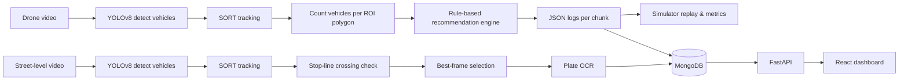

# Traffic Light Management (Computer Vision)

An end-to-end computer vision project that (1) **estimates per-approach queues from overhead drone footage** and produces **queue-aware traffic-signal recommendations**, and (2) **detects red-light violations** from street-level footage with **best-frame evidence** and **license-plate OCR**.

> Case study: Ramallah “5 Stars” intersection (4 approaches).

---

## What this repo contains

### 1) Queue-aware signal recommendations (overhead / drone view)
- **Vehicle detection:** YOLOv8
- **Multi-object tracking:** SORT (stable IDs across frames)
- **Per-approach counting:** polygonal ROIs (one polygon per approach)
- **State estimation:** virtual traffic-light regions + class priority logic (Red > Yellow > Green)
- **Decision engine:** rule-based selection of **one** next approach to serve (switch RED→YELLOW→GREEN) based on weighted queue estimates
- **Outputs:**
  - `recommendations/chunk_<id>_recommendations.json`
  - best-frame snapshots per approach (base64-encoded when uploaded)
  - annotated videos (optional)

### 2) Red-light violation detection (street-level)
- **Vehicle detection:** YOLOv8 (default weights)
- **Plate detection:** YOLO-based plate detector
- **Tracking:** SORT (vehicle ↔ plate association over time)
- **Violation logic:** stop-line crossing while light is RED
- **Evidence:** best-frame selection (clearest plate / sharpest frame) + short violation clip + OCR
- **Storage:** MongoDB documents with metadata (timestamp, plate text, evidence)

### 3) Web visualization (optional)
- **Backend:** FastAPI
- **Frontend:** React + Tailwind
- **DB:** MongoDB
- Dashboards for:
  - live / historical queue metrics + recommendations
  - violation evidence (best frames, clips, OCR result)

---

## Results (reported)
- **Vehicle detection:** **91.7% mAP@0.5** on the validation set (YOLOv8).
- **Traffic flow (simulation):** ~**+0.25 cars/s** throughput vs. a fixed-timing baseline cycle (agent-based replay of recommendations).

> Note: throughput is measured in simulation by replaying recommendation logs and comparing against a fixed schedule.

---

## System pipeline (high level)



---

## Repo structure (typical)

> Your repo may differ slightly; adjust names as needed.

```
.
├─ Traffic Light Management.ipynb     # main notebook (chunking + mgmt pipeline)
├─ data/
│  ├─ VideoInputStream.mp4            # not committed (large / private)
│  ├─ polygons.csv                    # ROI polygons (per frame)
│  └─ ...
├─ recommendations/                   # generated JSON files
├─ best_frames/                       # generated evidence frames
├─ outputs_video/                     # annotated outputs (optional)
└─ web/
   ├─ backend/                        # FastAPI (optional)
   └─ frontend/                       # React (optional)
```

---

## Getting started

### Prerequisites
- Python 3.10+
- `ffmpeg` installed (recommended for video work)
- GPU recommended for faster inference (works on CPU for small tests)
- A MongoDB instance (local or Atlas)

### Install
```bash
pip install -r requirements.txt
# or, minimal:
pip install ultralytics opencv-python numpy pymongo filterpy flask
```

### Set environment variables (recommended)
**Do NOT hardcode credentials in code or commits.**
```bash
export MONGO_URI="mongodb+srv://<user>:<pass>@<cluster>/<db>?retryWrites=true&w=majority"
export DB_NAME="trafficmanagement"
export COL_NAME="records"
```

---

## Running the traffic-management pipeline (drone view)

### 1) Prepare inputs
- `VideoInputStream.mp4` (overhead drone footage)
- `polygons.csv` containing 4-point polygons for each approach ROI (optionally per frame)

### 2) Run
Open and run the notebook:
- `Traffic Light Management.ipynb`

Core steps performed:
1. Split the long video into **chunks** (frame ranges).
2. For each chunk:
   - run YOLOv8 inference
   - track vehicles with SORT
   - count vehicles per ROI
   - detect light state in virtual traffic-light boxes
   - on **Yellow→Green** transitions: save counts + update **best frame**
3. Generate recommendations:
   - compute weighted queue scores
   - select the next approach to serve
   - write `recommendations/chunk_<id>_recommendations.json`
4. Upload a compact record to MongoDB (chunk id, video path, best frames, recommendations)

---

## Recommendation format (example)

```json
[
  {
    "current": "ID-4",
    "recommended": "ID-2",
    "duration_sec": 18,
    "all_counts": {"ID-1": 7, "ID-2": 8, "ID-3": 4, "ID-4": 3},
    "all_states": {"ID-1": "red", "ID-2": "yellow", "ID-3": "red", "ID-4": "green"}
  }
]
```

Interpretation:
- `current`: the approach currently being served (or the phase context)
- `recommended`: the approach we recommend switching next
- `duration_sec`: how long to keep it green (rule-based)
- `all_counts`: per-approach queue estimates at decision time
- `all_states`: estimated signal states (recommended approach is set to **yellow** before green)

---

## Red-light violation detection (street view)

This pipeline uses:
- virtual traffic light overlay (if real light isn’t reliably visible)
- a stop-line definition
- tracking (SORT) to persist vehicle identity
- best-frame selection to maximize OCR readability

Outputs stored per violation:
- best-frame image (base64)
- short video clip around the event
- OCR’d plate text
- timestamp + tracking IDs

---

## Practical notes (what interviewers usually ask)

- **Why SORT?** Lightweight online tracker that gives stable IDs and enables counting + event linking.
- **Why polygons?** Intersections aren’t axis-aligned; polygon ROIs map better to approach lanes.
- **Why best-frame selection?** YOLO can miss detections on single frames; selecting the peak-count frame improves robustness and evidence quality.
- **Why rule-based controller (not RL)?** Faster to validate, explainable decisions, and easy to tune for a PoC.

---

## Limitations
- Domain shift: different camera heights/angles and weather/lighting can reduce detection quality.
- OCR sensitivity: motion blur, glare, and plate angles impact recognition.
- PoC scope: no integration with physical controllers (uses recommendations + simulation).

---

## Citation
This repo is based on the team’s graduation project report and implementation. See the included report PDF for full methodology and evaluation details.

---

## License
Choose a license that matches how you want others to use the code (MIT / Apache-2.0 / etc.).
